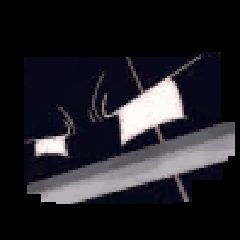

# 🍡 Mochi DFPlayer

[](https://github.com/rz7mong/mochi-dfplayer/actions/workflows/firmware.yml)
[](LICENSE)

Teman meja **ESP32-C3 Super Mini** + layar **ST7789 1,3" 240×240**, suaranya **MP3 lewat DFPlayer Mini**. Animasi disimpan sebagai **frame JPEG penuh warna di firmware**, jadi lebih tajam daripada GIF. Edisi bahasa Indonesia. Proyek independen yang terinspirasi Dasai Mochi, bukan produk resmi.

<p align="center">
  
  
  
  
</p>
<p align="center"><sub>GIF sumber. Di perangkat, tiap klip diubah jadi 6 frame JPEG saat build.</sub></p>

**Firmware 0.6.1** · **MIT © rzmong** · Situs + pemasang browser: **https://rz7mong.github.io/mochi-dfplayer/** (sumbernya di [`docs/`](docs/))

## ✨ Fitur

- **18 model bawaan** di flash: 10 wajah, 4 gundam, 4 mobil. Gambar JPEG 240×240, 100 ms per frame.
- **Suara MP3 per model** dari kartu microSD di DFPlayer Mini (`0001.mp3` … `0018.mp3`), volume 28 dari 30.
- **Satu tombol sentuh**: ketuk, ketuk dua kali, tahan.
- **Goyang** (opsional, MPU6050): klip lain di tema yang sama.
- **Hemat**: saat berhenti, layar dihitamkan dan lampu latar GPIO7 dimatikan.
- **Langsung jalan**: tanpa Wi-Fi, tanpa menu, tanpa pengaturan.
- **Pasang dari browser** (ESP Web Tools) atau build sendiri dengan PlatformIO.

## ⚖️ Mochi DFPlayer vs Mochi rzmong

| | **Mochi DFPlayer** (repo ini) | [Mochi rzmong](https://github.com/rz7mong/mochi-rzmong) |
|---|---|---|
| Suara | MP3 lewat DFPlayer Mini | WAV lewat amplifier MAX98357 (I2S) |
| Animasi | **Lebih tajam**: frame JPEG penuh warna, ditanam di firmware | GIF dari kartu SD atau flash, kurang tajam |
| Tambah / ganti animasi | Build lalu flash ulang ([caranya](#tambah-animasi)) | **Salin GIF ke kartu SD**, tanpa flash ulang |
| Ganti model | Ketuk 2× | Menu LCD atau halaman web |
| Wi-Fi + halaman pengaturan | Tidak ada | Ada (`http://192.168.4.1/`) |
| Chronos (BLE) | **Belum aktif di firmware 0.6.1** (lihat [Chronos](#chronos)) | Ada |
| Goyang (MPU6050) | Ada, opsional | Tidak ada |

Pilih **DFPlayer** kalau ingin gambar paling tajam dan suara MP3. Pilih **rzmong** kalau ingin sering ganti tema dari kartu SD dan mengatur dari HP.

> ⚠️ Firmware dan installer kedua repo **tidak bisa ditukar**. Installer mochi-rzmong untuk rakitan MAX98357, bukan DFPlayer.

## 🧺 Bahan

| Jumlah | Part | Catatan |
|---|---|---|
| 1 | ESP32-C3 Super Mini | flash 4 MB, USB-C |
| 1 | Layar ST7789 1,3" IPS 240×240 | SPI 7 pin (tanpa CS) atau 8 pin |
| 1 | DFPlayer Mini | slot microSD + amplifier 3 W |
| 1 | Speaker 8 Ω | 0,5–3 W |
| 1 | Kartu microSD | FAT32, ≤ 32 GB |
| 1 | Resistor 1 kΩ | jalur GPIO20 → RX DFPlayer |
| 1 | Tombol atau TTP223 | ke GPIO1, active-low ([catatan](#catatan-sentuh)) |
| 1 | MPU6050 | opsional, untuk goyang |

## 🔌 Kabel

Sumber: [`firmware/include/MochiRzmong.h`](firmware/include/MochiRzmong.h) dan [`User_Setup_ST7789.h`](firmware/include/User_Setup_ST7789.h).

| Kaki modul | ESP32-C3 | Catatan |
|---|---|---|
| TFT SCL / SCLK | GPIO4 | |
| TFT SDA / MOSI | GPIO6 | |
| TFT DC | GPIO3 | |
| TFT RES / RST | GPIO10 | |
| TFT CS | tidak dipakai | modul 8 pin: kaki CS ke GND |
| TFT BLK (lampu latar) | GPIO7 | HIGH nyala, LOW mati saat berhenti |
| TFT VCC | 3V3 | |
| Sentuh / tombol | GPIO1 | active-low (pull-up internal) |
| DFPlayer RX | GPIO20 lewat ±1 kΩ | ESP TX → RX modul |
| DFPlayer TX | GPIO21 | TX modul → ESP RX |
| DFPlayer VCC | 5 V | dari 5V/VBUS, bukan 3V3 |
| DFPlayer SPK_1 / SPK_2 | speaker 8 Ω | tanpa amplifier tambahan |
| MPU6050 SDA / SCL | GPIO8 / GPIO9 | opsional, alamat 0x68, pull-up 4,7 kΩ ke 3V3 jika perlu |
| MPU6050 VCC | 3V3 | |
| GND | semua modul | |

- **GPIO9** pin strap: jangan ditarik ke GND saat boot.
- **GPIO20/21** adalah UART0 bawaan chip. Log ESP keluar lewat **USB CDC**, bukan UART0.

<a id="catatan-sentuh"></a>**Catatan sentuh:** firmware membaca GPIO1 sebagai **LOW = ditekan**. Modul TTP223 bawaan pabrik justru HIGH saat disentuh (seperti di mochi-rzmong). Solder jumper **A** di TTP223 agar active-low, atau build dengan `-DMOCHI_TOUCH_ACTIVE_HIGH`.

## 💾 Kartu SD DFPlayer

1. Format **FAT32**.
2. Siapkan `0001.mp3` … `0018.mp3`. Nomor = urutan model.
3. Salin ke **root** kartu **satu per satu, berurutan** mulai `0001.mp3`.
4. Di macOS, hapus file `._*` (ikut terhitung sebagai trek).

| Trek | Model |
|---|---|
| `0001`–`0010` | wajah: vid_00, vid_01, vid_10, vid_11, vid_20, vid_21, vid_30, vid_31, vid_40, vid_41 |
| `0011`–`0014` | gundam: blade, titan, hadouken_hit, mecha_doc |
| `0015`–`0018` | mobil: car, turbo, headlights, speed_3 |

> **Kenapa harus berurutan?** Firmware memakai perintah DFPlayer `play(n)`, yang memutar file **ke-n menurut urutan salin** di FAT, bukan menurut nama file. Ingin dicocokkan dari nama? Build dengan `-DMOCHI_DF_MP3_FOLDER` dan simpan file di folder `/MP3/` (`/MP3/0001.mp3`, …).

> **Pakai suara pendek.** Trek diputar ulang dari awal tiap kali klip mengulang (6 frame × 100 ms ≈ 0,6 detik), juga saat goyang dan tahan. Lagu panjang akan terus terpotong.

Cek kartu: `python firmware/tools/daftar_trek.py --sd /path/ke/kartu` (file kurang, lebih, atau sampah macOS).

## 👆 Cara main

| Aksi | Hasil |
|---|---|
| Ketuk 1× | Putar / berhenti. Berhenti = layar hitam, lampu latar mati, DFPlayer berhenti. |
| Ketuk 2× (dalam 0,35 dtk) | Model berikutnya |
| Tahan ≥ 0,4 dtk | Klip **terakhir** di tema itu berulang sampai dilepas |
| Goyang 3× dalam 1 dtk | Klip lain di tema yang sama, sekali, lalu kembali (perlu MPU6050) |

Saat nyala, model 1 langsung diputar.

<a id="flash"></a>
## ⚡ Flash

**Dari browser (paling mudah):** buka **https://rz7mong.github.io/mochi-dfplayer/** di Chrome/Edge, tahan BOOT, colok USB-C, klik **Install**. Isinya [`docs/firmware/firmware.bin`](docs/firmware/) (gabungan bootloader + partisi + aplikasi, offset 0x0) dan [`manifest.json`](docs/firmware/manifest.json).

**Build sendiri (PlatformIO):**

```bash
pip install platformio pillow
cd firmware
pio run -e esp32-c3-dfplayer -t upload
pio device monitor        # 115200, lewat USB CDC
```

Tahan BOOT saat colok USB-C jika unggahan gagal. Saat build, `extra_script.py` menjalankan `tools/embed_assets.py` dan `tools/embed_jpeg.py` untuk membuat `include/jpeg_clips.h` (perlu Pillow).

**Opsi build** (tambahkan ke `build_flags` di `platformio.ini`):

| Flag | Fungsi |
|---|---|
| `-DMOCHI_DF_MP3_FOLDER` | Putar `/MP3/000N.mp3` berdasarkan nama file, bukan urutan salin |
| `-DMOCHI_TOUCH_ACTIVE_HIGH` | Sentuh HIGH = ditekan (TTP223 bawaan pabrik), dengan pull-down |

**Perbarui `docs/firmware/firmware.bin` setelah build:**

```bash
B=firmware/.pio/build/esp32-c3-dfplayer
python -m esptool --chip esp32c3 merge_bin -o docs/firmware/firmware.bin --flash_mode dio --flash_size 4MB \
  0x0 $B/bootloader.bin 0x8000 $B/partitions.bin \
  0xe000 ~/.platformio/packages/framework-arduinoespressif32/tools/partitions/boot_app0.bin \
  0x10000 $B/firmware.bin
```

Workflow [`firmware.yml`](.github/workflows/firmware.yml) juga membuat file ini sebagai artefak di setiap push/PR (tanpa commit otomatis).

<a id="tambah-animasi"></a>
## 🎞️ Tambah animasi baru

Animasi ditanam di firmware, jadi alurnya **ubah aset → build → flash ulang**:

1. Siapkan GIF **240×240**. Saat build hanya **6 frame pertama** yang dipakai (GIF 7–11 frame terpotong jadi 6; ≥12 frame diambil berselang), JPEG kualitas 62, diputar 100 ms per frame.
2. Simpan di `firmware/assets/builtin/gif/<tema>/<nama>.gif`.
3. Tambahkan `["<tema>", "<nama>"]` ke `"builtins"` di [`firmware/assets/meta.json`](firmware/assets/meta.json). **Urutan daftar = urutan model = nomor trek.**
4. Build + flash: `cd firmware && pio run -e esp32-c3-dfplayer -t upload`.
5. Lihat nomor trek baru dengan `python tools/daftar_trek.py`, lalu tambahkan MP3-nya ke kartu.

Aturan penting:

- Menyisipkan di tengah daftar **menggeser nomor trek** sesudahnya. Paling aman: tambahkan di akhir sebagai tema baru.
- Satu tema harus **berurutan**. Goyang memakai klip lain di tema yang sama; tahan memakai klip **terakhir** tema itu.
- Ruang app 3 MB ([`partitions.csv`](firmware/partitions.csv)); build sekarang memakai ±21%.
- Pakai hanya media yang kamu buat sendiri atau boleh kamu sebarkan ([THIRD_PARTY_NOTICES.md](THIRD_PARTY_NOTICES.md)).

<a id="chronos"></a>
## 📱 Chronos

Firmware 0.6.1 **belum** menjalankan Chronos/BLE: `src/main.cpp` tidak memanggil ChronosESP32. Pustaka `fbiego/ChronosESP32` memang ada di `platformio.ini` dan ada sisa UI di `include/chronos_ui.inc`, tapi belum disambungkan. Butuh notifikasi HP, jam, atau navigasi lewat aplikasi Chronos sekarang? Pakai [Mochi rzmong](https://github.com/rz7mong/mochi-rzmong#-jam-hp).

## 🛠️ Kalau ada masalah

| Gejala | Cek |
|---|---|
| Port tidak muncul | Chrome/Edge di komputer, kabel USB data, tahan BOOT saat colok |
| Layar hitam | SCLK 4, MOSI 6, DC 3, RST 10, BLK 7; CS modul 8 pin ke GND. Mode berhenti juga hitam: ketuk 1× |
| Tidak ada suara | DFPlayer VCC 5 V, GPIO20 →(1 kΩ)→ RX, TX → GPIO21, speaker di SPK_1/SPK_2, kartu FAT32. Firmware tidak bisa mendeteksi DFPlayer yang tidak tersambung |
| Suara salah model | Urutan salin. Format ulang, salin berurutan, hapus `._*`, atau pakai `-DMOCHI_DF_MP3_FOLDER` |
| Suara terpotong | Normal: trek diulang tiap klip mengulang (≈0,6 dtk). Pakai suara pendek |
| Ketukan tidak terbaca / selalu "tahan" | Polaritas sentuh, lihat [catatan sentuh](#catatan-sentuh) |
| Goyang tidak bereaksi | Serial harus menulis `MPU6050 siap`. SDA 8, SCL 9 |
| Build gagal `No module named PIL` | `pip install pillow` di Python yang dipakai PlatformIO |

## 📁 Isi repo

| Path | Isi |
|---|---|
| `firmware/src/main.cpp` | Pemutar JPEG, sentuh, goyang |
| `firmware/lib/MochiDfPlayer/` | Jalur suara DFPlayer (UART) |
| `firmware/assets/` | GIF sumber + `meta.json` (urutan model) |
| `firmware/tools/` | `embed_jpeg.py` (GIF → JPEG), `daftar_trek.py` (tabel trek + cek kartu) |
| `docs/` | Situs GitHub Pages + pemasang browser (`docs/firmware/`) |

MIT © rzmong. Lisensi pustaka pihak ketiga: [THIRD_PARTY_NOTICES.md](THIRD_PARTY_NOTICES.md).
