# 🍡 Mochi DFPlayer

[](https://github.com/rz7mong/mochi-dfplayer/actions/workflows/firmware.yml)
[](LICENSE)

Teman meja **ESP32-C3 Super Mini** + layar **ST7789 1,3" 240×240** dengan **suara MP3 lewat DFPlayer Mini**. Animasi disimpan sebagai **frame JPEG penuh warna di firmware**, jadi lebih tajam daripada GIF. Ada **pemutar MP3** di menu layar dan **Chronos (BLE)** untuk jam, notifikasi, panggilan, dan navigasi dari HP. Edisi bahasa Indonesia. Proyek independen yang terinspirasi Dasai Mochi, bukan produk resmi.

<p align="center">
  
  
  
  
</p>
<p align="center"><sub>Pratinjau kecil klip di firmware (wajah, mobil, gundam). Di perangkat semuanya frame JPEG 240 lebar.</sub></p>

**Firmware 0.7.1** · **MIT © rzmong** · Situs + pemasang browser: **https://rz7mong.github.io/mochi-dfplayer/** (sumber di [`docs/`](docs/))

### 📚 Panduan di situs

| Halaman | Isi |
|---|---|
| ⚡ [Instalasi firmware](https://rz7mong.github.io/mochi-dfplayer/) ([`docs/index.html`](docs/index.html)) | Flash dari browser, setelah flash, kalau gagal |
| 🧩 [Demo rakit](https://rz7mong.github.io/mochi-dfplayer/pemasangan.html) ([`docs/pemasangan.html`](docs/pemasangan.html)) | Komponen → solder tiap modul → kartu SD → flash → uji nyala, langkah demi langkah |
| 🔌 [Diagram kabel](https://rz7mong.github.io/mochi-dfplayer/pemasangan-kabel.html) ([`docs/pemasangan-kabel.html`](docs/pemasangan-kabel.html)) | Diagram lengkap, tabel pin per modul / per GPIO, tips |
| 🎵 [Animasi &amp; suara](https://rz7mong.github.io/mochi-dfplayer/kelola.html) ([`docs/kelola.html`](docs/kelola.html)) | Tambah GIF, suara animasi + Chronos (root `0001`–`0048`), pemutar musik `/01` |
| 📖 [Cara pakai](https://rz7mong.github.io/mochi-dfplayer/panduan.html) · 🔧 [Rakit &amp; kartu SD](https://rz7mong.github.io/mochi-dfplayer/instalasi.html) · 🎞️ [Tambah animasi](https://rz7mong.github.io/mochi-dfplayer/animasi.html) | Menu, gerakan, kartu SD, anggaran flash |

## ✨ Fitur

- **14 model animasi** di flash: 6 wajah, 2 mobil, 6 gundam (nama Indonesia). JPEG lebar 240, tempo per klip. Saat nyala langsung `wajah/senyum_kedip`.
- **Suara MP3 per model** dari kartu microSD DFPlayer (root `0001.mp3` … `0048.mp3`, menurut **urutan salin**), **diputar sampai habis** lalu diulang. **Semua 14 animasi punya suara** (isi kartu siap salin di [`sd/mp3/`](sd/mp3/)).
- **Pemutar MP3** di menu: putar/jeda, berikut/sebelum, volume, mode *ulang semua / ulang 1 / acak*, layar nomor trek dan volume. Lagu dari folder `/01`, terpisah dari suara animasi. Musik tetap jalan saat kembali ke animasi.
- **Chronos (BLE)**: jam dan tanggal dari HP, baterai HP, cuaca, kontrol musik HP, notifikasi (dibuka klip `cinta_pipi`), panggilan masuk, navigasi, cari perangkat, alarm, suara sambung/putus.
- **Satu tombol sentuh**: ketuk, ketuk 2×, tahan, tahan 2 detik (menu). TTP223 tanpa solder: jenis sensor dideteksi otomatis saat nyala.
- **Goyang** (opsional, MPU6050): klip "pusing" tema itu (tema tanpa klip pusing: klip lain di tema yang sama).
- **Pengaturan tersimpan** (volume, rotasi, Chronos, Jam HP, mode musik, lagu terakhir).
- **Pasang dari browser** (ESP Web Tools) atau build sendiri dengan PlatformIO.

## ⚖️ Mochi DFPlayer vs Mochi rzmong

| | **Mochi DFPlayer** (repo ini) | [Mochi rzmong](https://github.com/rz7mong/mochi-rzmong) |
|---|---|---|
| Suara | MP3 lewat DFPlayer Mini | WAV lewat amplifier MAX98357 (I2S) |
| Animasi | **Lebih tajam**: frame JPEG penuh warna, ditanam di firmware | GIF dari kartu SD atau flash, kurang tajam |
| Tambah / ganti animasi | Build lalu flash ulang ([caranya](#tambah-animasi)) | **Salin GIF ke kartu SD**, tanpa flash ulang |
| Pemutar musik | **Ada** (menu LCD, folder `/01`) | Tidak ada |
| Chronos (BLE) | Ada, diatur dari menu LCD | Ada, diatur dari halaman web |
| Wi-Fi + halaman pengaturan | Tidak ada | Ada (`http://192.168.4.1/`) |
| Goyang (MPU6050) | Ada, opsional | Tidak ada |

> ⚠️ Firmware dan installer kedua repo **tidak bisa ditukar**. Installer mochi-rzmong untuk rakitan MAX98357, bukan DFPlayer.

## 🧺 Bahan

| Jumlah | Part | Catatan |
|---|---|---|
| 1 | ESP32-C3 Super Mini | flash 4 MB, USB-C, BLE |
| 1 | Layar ST7789 1,3" IPS 240×240 | SPI 7 pin (tanpa CS) atau 8 pin |
| 1 | DFPlayer Mini | slot microSD + amplifier 3 W |
| 1 | Speaker 8 Ω (4 Ω juga bisa) | 0,5–3 W, ke SPK_1 / SPK_2 |
| 1 | Kartu microSD | FAT32, ≤ 32 GB |
| 1 | Resistor 1 kΩ | jalur GPIO20 → RX DFPlayer |
| 1 | Tombol atau TTP223 | ke GPIO1, tanpa solder; jenis dideteksi saat nyala ([catatan](#catatan-sentuh)) |
| 1 | MPU6050 (GY-521) | opsional, untuk goyang. Tanpa modul ini goyang mati, yang lain jalan |
| 1 | Elko 100–470 µF | disarankan, di VCC–GND DFPlayer (mengurangi letup / reset saat volume keras) |
| 2 | Resistor 4,7 kΩ | opsional, pull-up SDA/SCL ke 3V3 jika modul MPU6050 belum punya |

## 🔌 Kabel

Sumber: [`firmware/include/MochiRzmong.h`](firmware/include/MochiRzmong.h) dan [`User_Setup_ST7789.h`](firmware/include/User_Setup_ST7789.h).

<p align="center"></p>

Rakit langkah demi langkah: [Demo rakit](https://rz7mong.github.io/mochi-dfplayer/pemasangan.html) · tabel lengkap: [Diagram kabel](https://rz7mong.github.io/mochi-dfplayer/pemasangan-kabel.html).

| Kaki modul | ESP32-C3 | Catatan |
|---|---|---|
| TFT SCL / SCLK | GPIO4 | |
| TFT SDA / MOSI | GPIO6 | |
| TFT DC | GPIO3 | |
| TFT RES / RST | GPIO10 | |
| TFT CS | tidak dipakai | modul 8 pin: kaki CS ke GND |
| TFT BLK (lampu latar) | GPIO7 | HIGH nyala, LOW mati saat berhenti |
| TFT VCC | 3V3 | |
| Sentuh / tombol | GPIO1 | polaritas dideteksi otomatis saat nyala |
| DFPlayer RX | GPIO20 lewat ±1 kΩ | ESP TX → RX modul |
| DFPlayer TX | GPIO21 | TX modul → ESP RX. **Wajib** agar "trek selesai" terdeteksi |
| DFPlayer BUSY | GPIO5 (opsional) | aktifkan dengan `-DMOCHI_PIN_DF_BUSY=5` |
| DFPlayer VCC | 5 V | dari 5V/VBUS, bukan 3V3 |
| DFPlayer SPK_1 / SPK_2 | speaker 8 Ω | tanpa amplifier tambahan |
| MPU6050 SDA / SCL | GPIO8 / GPIO9 | opsional, alamat 0x68, pull-up 4,7 kΩ ke 3V3 jika perlu |
| MPU6050 VCC | 3V3 | |
| GND | semua modul | |

- **GPIO9** pin strap: jangan ditarik ke GND saat boot.
- **GPIO20/21** adalah UART0 bawaan chip. Log ESP keluar lewat **USB CDC**, bukan UART0.

<a id="catatan-sentuh"></a>**Catatan sentuh:** saat nyala firmware membaca GPIO1 ±0,2 detik dengan pull-up lalu pull-down untuk mengenali jenis sensor: TTP223 bawaan pabrik (HIGH saat disentuh), TTP223 dengan pad A disolder (LOW saat disentuh), atau tombol tekan ke GND. Jadi **TTP223 tidak perlu disolder**. Syaratnya: jangan sentuh sensor ±1 detik setelah nyala (TTP223 juga mengkalibrasi diri). Kalau terlanjur dan sensor terbaca tersentuh terus, polaritas dibalik otomatis setelah 10 detik. Paksa manual: `-DMOCHI_TOUCH_ACTIVE_HIGH` (aktif HIGH) atau `-DMOCHI_TOUCH_MODE=2` (aktif LOW + pull-up). Serial monitor menulis jenis yang terdeteksi: `sentuh GPIO1: …`.

<a id="kartu-sd"></a>
## 💾 Kartu SD DFPlayer

Isi kartu siap pakai ada di [`sd/mp3/`](sd/mp3/) (48 file, 1,4 MB). Firmware memutar file root menurut **urutan salin** (perintah DFPlayer 0x03: "file ke-N yang disalin"), **bukan nama**. Jadi:

1. **Format** kartu FAT32 (≤ 32 GB), kartu harus kosong.
2. Salin `sd/mp3/0001.mp3` … `0048.mp3` ke **root**, **berurutan, satu per satu** (jangan seret sekaligus; Explorer/Finder bisa menyalin acak).
3. **Baru setelah itu** buat folder `/01` dan salin lagu `001.mp3`, `002.mp3`, … (folder ikut terhitung di urutan global, jadi harus sesudah root).

```bash
# Linux (kartu di /media/SD)
for f in sd/mp3/*.mp3; do cp "$f" /media/SD/; sync; done
mkdir /media/SD/01 && cp lagu/*.mp3 /media/SD/01/
```

```powershell
# Windows PowerShell (kartu di E:)
Get-ChildItem sd\mp3\*.mp3 | Sort-Object Name | ForEach-Object { Copy-Item $_.FullName E:\ }
New-Item -ItemType Directory E:\01; Copy-Item lagu\*.mp3 E:\01\
```

```
/0001.mp3 … /0048.mp3      root: suara animasi + suara Chronos (tabel di bawah), disalin PERTAMA
/01/001.mp3 … 255.mp3      lagu untuk Pemutar MP3, disalin SESUDAH root
```

- Nomor yang tidak dipakai berisi MP3 hening 0,5 dtk. **Jangan dihapus**: tanpa pengisi, urutan salin bergeser dan suara tertukar.
- Ganti suara: timpa file dengan nama yang sama lalu ulangi langkah 1–3 (format dulu), supaya urutannya tetap.
- Nomor lagu di `/01` **harus berurutan tanpa lubang** (001, 002, 003 …). "Berikutnya" berhenti di lubang pertama lalu kembali ke 001.
- Di macOS, hapus file `._*` dan `.DS_Store` (ikut terhitung sebagai file): `dot_clean /Volumes/SD`.
- Cek kartu: `python firmware/tools/daftar_trek.py --sd /path/ke/kartu`.
- Buat ulang semua MP3: `python3 sd/buat_suara.py` (numpy + ffmpeg).
- Ingin dicocokkan dari **nama** (urutan bebas)? Build dengan `-DMOCHI_DF_MP3_FOLDER` dan taruh file yang sama di `/MP3/0001.mp3` … (catatan: loop dering/cari/alarm lalu diulang oleh firmware, bukan modul).

**Tabel kartu SD (semua nomor)**

| File | Dipakai untuk | Suara (`sd/mp3/`) | Sumber |
|---|---|---|---|
| `0001`–`0018` | – | hening 0,5 dtk (pengisi) | sintetis |
| `0019` | model 1 wajah/senyum_kedip (klip saat nyala) | tawa kecil "hi-hi-hi" + denting kedip, 8 dtk | sintetis |
| `0020` | model 2 wajah/pusing (goyang) | nada goyang menurun + per "boing", 4,4 dtk | sintetis |
| `0021` | model 4 wajah/sorot | desis lirik kiri-kanan + blip, 6 dtk | sintetis |
| `0022` | model 5 wajah/sirine | sirine polisi naik-turun ×2, 3,8 dtk | sintetis |
| `0023` | model 3 wajah/cinta (tahan) | detak jantung + arpeggio + kilau, 2,5 dtk | sintetis |
| `0024`–`0025` | – | hening (pengisi) | sintetis |
| `0026` | model 9 gundam/helm_hujan | hujan di helm + tetes + servo, 3 dtk | sintetis |
| `0027` | model 10 gundam/helm_siaga (tahan) | servo + bip siaga, 1,6 dtk | sintetis |
| `0028` | model 11 gundam/isyarat | sandi radio + statis, 2,6 dtk | sintetis |
| `0029` | model 12 gundam/kokpit | dengung kokpit + blip komputer, 3 dtk | sintetis |
| `0030` | model 13 gundam/kokpit_2 | sistem menyala (sapuan naik) + dengung, 3 dtk | sintetis |
| `0031` | model 14 gundam/pilot | servo + kunci mekanis + bip, 2,6 dtk | sintetis |
| `0032`–`0033` | – | hening (pengisi) | sintetis |
| `0034` | model 7 mobil/lampu_sorot | klik lampu + desis sorot + mesin idle, 6,7 dtk | sintetis |
| `0035`–`0037` | – | hening (pengisi) | sintetis |
| `0038` | model 8 mobil/speedometer (tahan) | gas, pindah gigi, gas, 4,2 dtk | sintetis |
| `0039` | – | hening (pengisi) | sintetis |
| `0040` | model 6 wajah/cinta_pipi | "uwu" malu + lonceng kecil, 3 dtk | sintetis |
| `0041` | Chronos notifikasi | ding-ding naik | sintetis |
| `0042` | Chronos instruksi navigasi baru | tiga nada naik | sintetis |
| `0043` | Chronos panggilan masuk (diulang) | trill dering | sintetis |
| `0044` | Chronos cari perangkat (diulang, volume 30) | bip tinggi keras | sintetis |
| `0045` | Chronos alarm (diulang) | bip-bip-bip-bip | sintetis |
| `0046` | Chronos tersambung | dua nada naik | sintetis |
| `0047` | Chronos terputus | dua nada turun | sintetis |
| `0048` | Chronos navigasi selesai | arpeggio selesai | sintetis |

"Sintetis" = dibuat dari nol oleh [`sd/buat_suara.py`](sd/buat_suara.py) (numpy, tanpa sampel luar), MIT seperti kode. Suara animasi diberi jeda hening di akhir karena firmware mengulang trek saat selesai.
Alternatif: `python3 sd/buat_suara.py --pack mochi-themes.zip` mengganti 14 suara animasi dengan potongan WAV asli dari paket tema rzmong ([mochi-rzmong `assets-v1`](https://github.com/rz7mong/mochi-rzmong/releases/tag/assets-v1): mis. `gundam/kokpit.wav`, `polisi/police.wav`, `mobil/headlights.wav`, `wajah/love_hearts_kiss.wav`). Paket itu tidak mencantumkan lisensi, jadi hasilnya tidak dimasukkan ke repo; pakai untuk kartu sendiri.

## 👆 Cara main

**Animasi** (layar utama)

| Gerakan | Hasil |
|---|---|
| Ketuk 1× | Putar / berhenti. Berhenti = layar hitam + lampu mati. Musik dari pemutar tetap jalan |
| Ketuk 2× (dalam 0,35 dtk) | Model berikutnya |
| Tahan ≥ 0,4 dtk | Klip "tahan" tema itu berulang sampai dilepas |
| Tahan 2 dtk | **Buka menu** |
| Goyang 3× dalam 1 dtk | Klip "goyang" tema itu sekali, lalu kembali (perlu MPU6050) |

Sentuhan dalam 0,8 dtk pertama setelah nyala diabaikan; jika sensor sudah tersentuh saat nyala, firmware menunggu dilepas dulu. Tema mobil tidak punya klip goyang/tahan khusus: tahan memakai klip terakhirnya (speedometer), goyang memakai klip berikutnya.

Suara model diputar sampai habis lalu diulang. Klip goyang/tahan memutar suaranya sendiri; setelah selesai suara model utama mulai lagi dari awal. Saat pemutar musik aktif (main atau jeda), animasi tanpa suara.

**Menu** — ketuk 1× = pindah, ketuk 2× = pilih, tahan 2 dtk = tutup

| Item | Fungsi |
|---|---|
| Pemutar MP3 | Buka layar pemutar |
| Kembali ke animasi | Tutup menu (dan matikan Jam HP) |
| Volume + / Volume − | Langkah 2, rentang 0–30 (satu volume untuk animasi dan musik) |
| Chronos BLE | Nyala/mati Bluetooth untuk aplikasi Chronos |
| Jam HP | Layar jam dari HP sebagai layar utama (menyalakan Chronos) |
| Tampil navigasi | Tampilkan layar navigasi Chronos |
| Putar layar | Rotasi 0° / 90° / 180° / 270° |
| Tentang | Versi, nama BLE, status Chronos, baterai HP |

**Pemutar MP3** — layar menampilkan nomor trek, jumlah lagu, status, mode, volume, dan 7 tombol.

| Gerakan | Hasil |
|---|---|
| Ketuk 1× | Jalankan tombol yang disorot (langsung, tanpa jeda) |
| Tahan 0,4–2 dtk lalu lepas | Sorot tombol berikutnya |
| Tahan 2 dtk | Kembali ke menu (musik tetap jalan) |

Tombol berurutan: **⏯ putar/jeda · ⏭ berikutnya · ⏮ sebelumnya · 🔊+ · 🔉− · mode (ulang semua → ulang 1 → acak) · ■ berhenti**. Saat masuk, sorotan di ⏯. Ketuk berulang di 🔊+ untuk menaikkan volume cepat.

<a id="chronos"></a>
## 📱 Chronos

1. Pasang aplikasi **Chronos** (fbiego) di HP Android.
2. Di perangkat: tahan 2 dtk → menu → **Chronos BLE** → ketuk 2× (jadi ON).
3. Di aplikasi Chronos, sambungkan perangkat **`rzmong dfplayer`**.
4. Opsional: menu → **Jam HP** untuk layar jam (tanggal, hari, jam:menit, mata berkedip, baterai HP, cuaca, lagu di HP).

| Dari HP | Di perangkat | Suara | Sentuh |
|---|---|---|---|
| Tersambung / terputus | Info 1,5 dtk | `0046` / `0047` | |
| Notifikasi | Klip `wajah/cinta_pipi` ±1,5 dtk, lalu aplikasi, judul, pesan (teks panjang bergulir), 7–30 dtk | `0041` | ketuk = tutup |
| Panggilan masuk | Nama penelepon, layar berkedip | `0043` diulang | ketuk/tahan = tutup + bisukan (menolak panggilan tidak didukung aplikasi) |
| Navigasi (menu "Tampil navigasi" ON) | Ikon arah, jarak, petunjuk, ETA | `0042` tiap instruksi baru, `0048` saat selesai | ketuk = sembunyikan sampai navigasi berikutnya |
| Cari perangkat | Layar berkedip 60 dtk | `0044` diulang, volume 30 | ketuk = berhenti |
| Alarm (diatur di aplikasi) | Layar alarm berkedip 60 dtk | `0045` diulang | ketuk = berhenti |
| Waktu, baterai HP, cuaca | Layar Jam HP dan Tentang | | |
| Musik di HP | Judul lagu di layar Jam HP | | Jam HP: ketuk = putar/jeda, ketuk 2× = lagu berikutnya |

Prioritas layar: cari > panggilan > alarm > notifikasi > navigasi > info. Selama layar Chronos tampil, suara animasi diam; musik dari pemutar dipotong lalu diulang dari awal trek setelahnya. Notifikasi tidak memotong dering panggilan. Mode Jangan Ganggu di aplikasi membisukan suara notifikasi.

Chronos mati secara bawaan (hemat daya).

## ⚡ Flash

**Dari browser:** buka **https://rz7mong.github.io/mochi-dfplayer/** di Chrome/Edge, tahan BOOT, colok USB-C, klik **Install** (centang *Erase* saat naik dari versi < 0.7.0). Isinya [`docs/firmware/firmware.bin`](docs/firmware/) (gabungan bootloader + partisi + aplikasi, offset 0x0) dan [`manifest.json`](docs/firmware/manifest.json).

**Build sendiri (PlatformIO):**

```bash
pip install platformio pillow
cd firmware
pio run -e esp32-c3-dfplayer -t upload
pio device monitor        # 115200, lewat USB CDC
```

Saat build, `extra_script.py` menjalankan `tools/embed_jpeg.py` yang menanam klip ke `include/jpeg_clips.h`.

**Opsi build** (tambahkan ke `build_flags` di `platformio.ini`):

| Flag | Fungsi |
|---|---|
| `-DMOCHI_DF_MP3_FOLDER` | Suara di `/MP3/0001.mp3` …, dicocokkan dari nama (bawaan: root, urutan salin) |
| `-DMOCHI_PIN_DF_BUSY=5` | Pakai pin BUSY DFPlayer di GPIO5 untuk deteksi trek selesai |
| `-DMOCHI_TOUCH_ACTIVE_HIGH` | Paksa sentuh HIGH = ditekan, dengan pull-down (bawaan: deteksi otomatis saat nyala) |
| `-DMOCHI_TOUCH_MODE=2` | Paksa sentuh LOW = ditekan, dengan pull-up (tombol ke GND / TTP223 pad A) |
| `-DMOCHI_DEFAULT_ROTATION=0` | Rotasi awal layar (0–3, bawaan 2 = pin LCD di bawah, tatakan GMT130). Menu "Putar layar" menimpanya |
| `-DMOCHI_BLE_NAME=\"nama\"` | Nama perangkat di aplikasi Chronos |

**Ukuran flash.** App 0x3F0000 (4.128.768 B, partisi terbesar di flash 4 MB). Build 0.7.1: **94,7%** flash (3.910.770 B), RAM 12,9%. Klip JPEG mentah 3,43 MB (14 klip) tidak muat bersama BLE, jadi `embed_jpeg.py` punya **anggaran** (`custom_jpeg_budget = 3300000` di `platformio.ini`). Jika total klip melebihinya, frame yang **nyaris sama** dengan frame sebelumnya (saat ini ≤ 0,3% piksel berbeda, jadi 3,26 MB) dipakai ulang. Jumlah frame dan tempo tetap; file aset tidak diubah. Hasilnya tercetak saat build (`ANGGARAN: …`).

**Perbarui `docs/firmware/firmware.bin` setelah build:**

```bash
B=firmware/.pio/build/esp32-c3-dfplayer
python -m esptool --chip esp32c3 merge_bin -o docs/firmware/firmware.bin --flash_mode dio --flash_size 4MB \
  0x0 $B/bootloader.bin 0x8000 $B/partitions.bin \
  0xe000 ~/.platformio/packages/framework-arduinoespressif32/tools/partitions/boot_app0.bin \
  0x10000 $B/firmware.bin
```

Workflow [`firmware.yml`](.github/workflows/firmware.yml) membuat file yang sama sebagai artefak di setiap push/PR (tanpa commit otomatis).

<a id="tambah-animasi"></a>
## 🎞️ Tambah animasi baru

Animasi ditanam di firmware, jadi alurnya **impor → daftarkan → build → flash ulang**:

1. Impor klip (GIF, folder JPEG/PNG, atau header C) menjadi `firmware/assets/builtin/jpeg/<tema>/<nama>.mjpeg` + `.json`:
   ```bash
   cd firmware
   python tools/import_jpeg_clip.py <tema> <nama> sumber.gif --quality 80
   python tools/import_jpeg_clip.py <tema> <nama> folder_frame/
   ```
   Opsi: `--resize`, `--crop`, `--step`, `--hold`, `--delay` (lihat `--help`). Frame lebih kecil dari 240×240 digambar di tengah.
2. Daftarkan di `firmware/assets/meta.json` → `"jpeg_clips"`: `["<tema>", "<nama>", "", <trek>]`. Peran: `""` biasa, `"dizzy"` saat goyang, `"heart"` saat tahan. Trek boleh dikosongkan (otomatis nomor berikutnya). Tambahkan di **akhir** `"jpeg_clips"`, jangan di `"builtins"` (nomor trek builtin = posisinya, jadi baris baru akan bentrok dengan trek 19 `wajah/senyum_kedip`). Panduan lengkap: [Animasi & suara](https://rz7mong.github.io/mochi-dfplayer/kelola.html).
3. Build + flash: `pio run -e esp32-c3-dfplayer -t upload`. Perhatikan baris `ANGGARAN` jika klip banyak.
4. `python tools/daftar_trek.py` untuk melihat nomor trek, taruh suaranya sebagai `sd/mp3/000N.mp3` (nomor 0001–0040 yang masih hening, atau tambah di `KLIP` dalam `sd/buat_suara.py`), lalu salin ulang kartu sesuai [urutan salin](#kartu-sd). Nomor 0041–0048 dipakai Chronos.

Aturan: klip satu tema selalu dikelompokkan. `meta.json` `"theme_order"` mengatur urutan tema (sekarang wajah, mobil, gundam; tema lain di akhir), `"boot_theme"` menentukan model saat nyala (sekarang `wajah`). Pakai hanya media yang boleh kamu sebarkan ([THIRD_PARTY_NOTICES.md](THIRD_PARTY_NOTICES.md)).

## 🛠️ Kalau ada masalah

| Gejala | Cek |
|---|---|
| Port tidak muncul | Chrome/Edge di komputer, kabel USB data, tahan BOOT saat colok. Linux: tambahkan user ke grup `dialout`. Tutup monitor serial lain |
| Layar hitam | SCLK 4, MOSI 6, DC 3, RST 10, BLK 7; CS modul 8 pin ke GND. Mode berhenti juga hitam: ketuk 1× |
| Gambar terbalik/miring | Menu → Putar layar, atau `-DMOCHI_DEFAULT_ROTATION` |
| Tidak ada suara | DFPlayer VCC 5 V, GPIO20 →(1 kΩ)→ RX, TX → GPIO21, speaker SPK_1/SPK_2, kartu FAT32 berisi `0001`–`0048` di root. Serial: `DFPlayer menjawab` |
| Suara tertukar (mis. animasi berbunyi dering) | Urutan salin salah: format kartu, salin `sd/mp3/` satu per satu berurutan, baru `/01`. Hapus `._*` di macOS |
| Suara tidak diulang / lagu tidak lanjut | Kabel TX modul → GPIO21 (pesan "trek selesai"), atau pasang BUSY + `-DMOCHI_PIN_DF_BUSY=5` |
| Pemutar: "folder /01 kosong" | Lagu harus `/01/001.mp3`, `/01/002.mp3`, … |
| Ketukan tidak terbaca / selalu "tahan" | Lihat log `sentuh GPIO1: …` dan [catatan sentuh](#catatan-sentuh). "tombol ke GND / mengambang" padahal TTP223 = kabel I/O putus. VCC TTP223 3V3. Casing di atas TTP223 ≤ 2 mm, tanpa logam |
| Bunyi letup / ESP reset saat suara mulai | Daya USB kurang: kabel/charger lebih baik, kapasitor 100–470 µF di VCC–GND DFPlayer |
| Warna negatif / merah-biru tertukar | `User_Setup_ST7789.h`: `TFT_INVERSION_ON` → `TFT_INVERSION_OFF`, atau `TFT_RGB_ORDER` `TFT_BGR` → `TFT_RGB` |
| Build: `No module named PIL` | `~/.platformio/penv/bin/pip install pillow` (Python milik PlatformIO) |
| Chronos tidak menemukan perangkat | Menu → Chronos BLE harus ON. Nama `rzmong dfplayer` |
| Goyang tidak bereaksi | Serial harus menulis `MPU6050 siap`. SDA 8, SCL 9 |
| Build: `tidak muat di anggaran` | Klip terlalu banyak. Kurangi klip atau atur `custom_jpeg_budget` (lalu cek ukuran app) |

## 📁 Isi repo

| Path | Isi |
|---|---|
| `firmware/src/main.cpp` | Animasi, sentuh, goyang, menu, pemutar MP3, jam, overlay Chronos |
| `firmware/include/chronos_ui.inc` | Layar + callback Chronos: notifikasi, panggilan, navigasi, cari, alarm, cuaca, musik |
| `firmware/lib/MochiDfPlayer/` | DFPlayer: trek urutan salin, trek diulang, folder musik, deteksi trek selesai |
| `sd/mp3/`, `sd/buat_suara.py` | Isi kartu SD siap salin (0001–0048) dan pembuatnya |
| `firmware/assets/` | Klip JPEG (`builtin/jpeg/`), GIF sumber, `meta.json` |
| `firmware/tools/` | `import_jpeg_clip.py`, `embed_jpeg.py`, `daftar_trek.py` |
| `docs/` | Situs GitHub Pages + pemasang browser (`docs/firmware/`) |

MIT © rzmong untuk kode. Klip wajah, mobil, dan gundam punya catatan hak tersendiri di [THIRD_PARTY_NOTICES.md](THIRD_PARTY_NOTICES.md).
